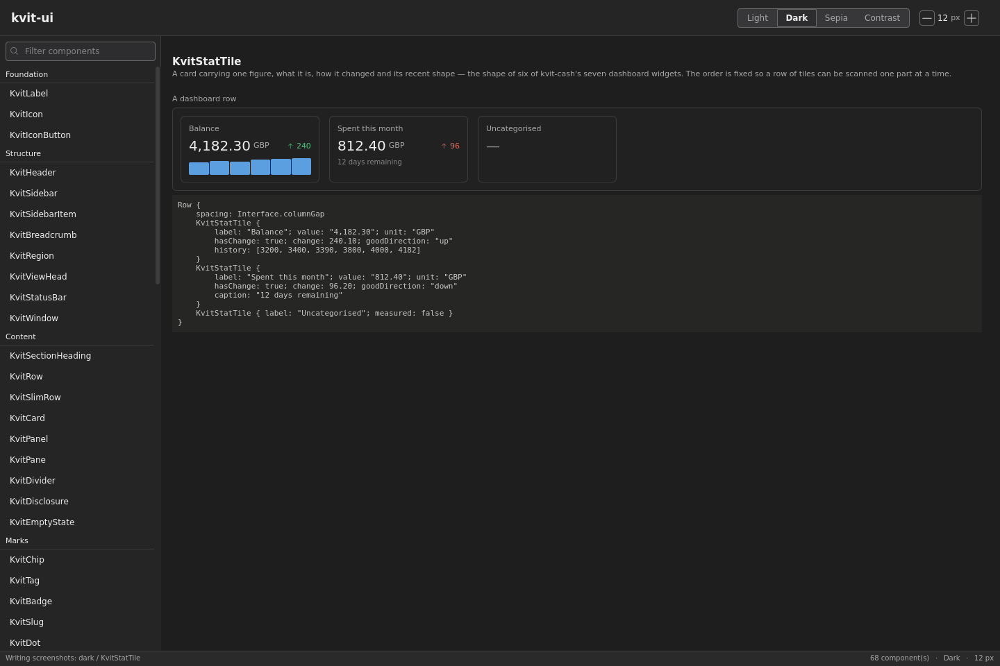
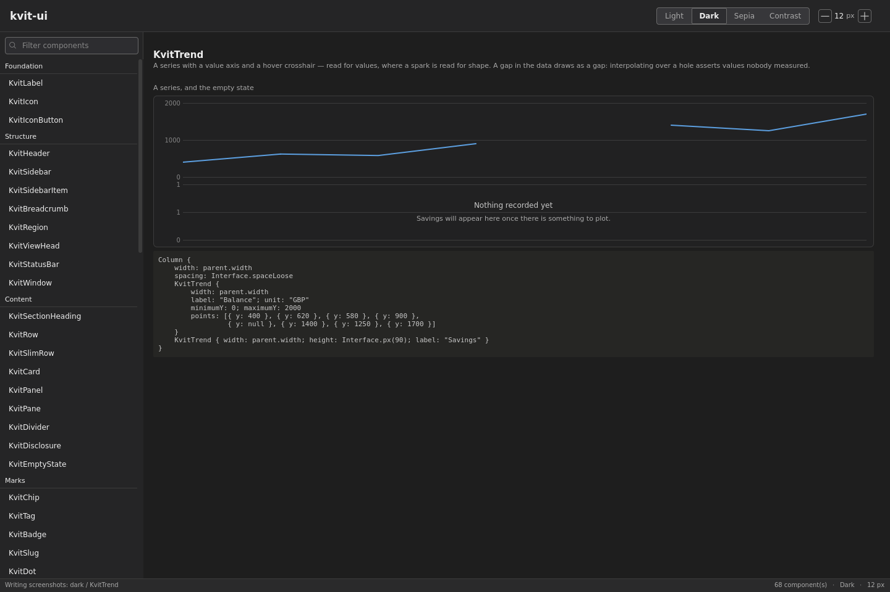
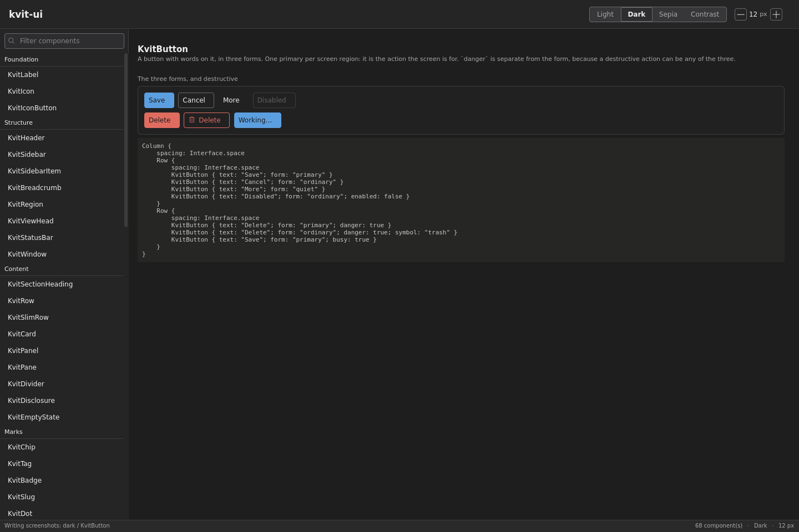
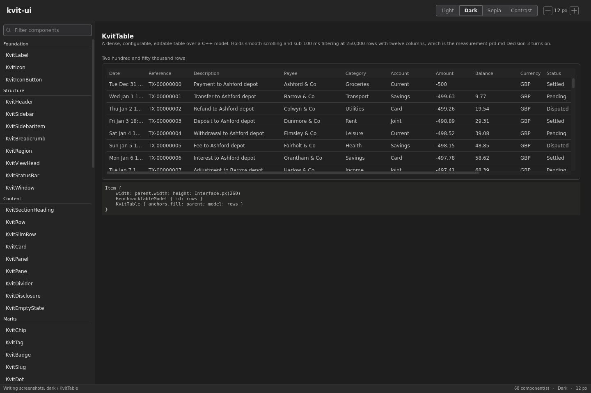

# kvit-ui

**A QML component library and design-token system for information-dense Qt 6
desktop applications.**

Sixty-eight components behind one import, four complete themes, and a token
layer written in C++ that moves every type size and every geometry value
together when the reader changes one setting. The rules that keep it coherent
— no colour literal in a call site, no numeric font size, no distinction that
rests on hue alone — are held by the test suite, so a screen that breaks one
of them fails the build rather than a review.


## Gallery preview

Every component has a page in the gallery application, showing its states and
a code sample that the test suite compiles. These four pages are the dashboard
tiles, a trend with its empty state, the button forms and the 250,000-row
table, all in the dark theme.






## What it is for

Qt Quick Controls gives you a set of controls. It does not give you a design
system, so an application with a lot of information on one screen — a ledger,
a dashboard, a portfolio view, an editor with a dense sidebar — ends up
inventing its own rows, chips, figures and sparklines, and re-deciding
spacing, colour and type on every new view. Those decisions drift, and the
drift is invisible on the machine where each one was made: a hex value picked
in the dark theme is wrong in the other three, a hardcoded 30-pixel row stops
fitting the moment somebody enlarges the interface, and a status shown only by
colour disappears for a reader who cannot separate red from green.

kvit-ui is that missing layer. It has three parts.

**Tokens.** Every value the interface draws with, as named C++ properties
published to QML as singletons: `Theme` for colour across four themes,
`Interface` for the chrome's type scale, spacing, row heights, control
heights, radii and reflow breakpoints, and `Typography` for document text in
applications that have documents. One interface-size setting, from 10 to 24
pixels, moves every type role and every density value at once, which is what
stops a row becoming too tight for the text inside it at any size.

**Components.** Sixty-eight QML types under the `Kvit` prefix, built from the
tokens: the window and its structure, rows and cards, marks and figures,
controls, feedback, a data-display vocabulary (bars, sparklines, trends,
distributions, gauges, stat tiles) and a table that holds 250,000 rows.

**A drawing layer.** A stylesheet generated from the same token table, a
hand-written frame stylesheet, and a headless renderer, so a screen can be
proposed as an image before any QML is written, in the colours the application
will actually use.

Everything is reached through one import:

```qml
import Kvit.Ui
```

## Features

- **Sixty-eight components in nine groups**, all in one QML module, all drawn
  from tokens.
- **Four themes**, light, dark, sepia and high contrast, switched at
  runtime, plus a `system` setting that follows the desktop's light/dark
  preference.
- **One interface size**, 10 to 24 pixels, that scales seven type roles and
  every named spacing, row height, control height and radius together.
- **Accessibility checked by tests rather than by eye.** Contrast floors are
  asserted per theme; the three chart ramps are validated in OKLab against
  every surface they can be drawn on and against three common colour-vision
  deficiencies; every state carries a second channel besides hue.
- **Dense-data components.** `KvitTable` holds smooth scrolling and sub-100 ms
  filtering at 250,000 rows and twelve columns, measured by a benchmark in the
  suite.
- **Seventy-four icons named by meaning**, not by drawing, from the Phosphor
  set, shipped inside the module. An unknown name draws a marked placeholder
  and fails a test.
- **The gallery is the documentation.** One page per component with its states
  and a working sample, and a fixed screenshot set that makes a token change
  reviewable as a diff.
- **Two agent skills** for AI coding tools, installed with the library, so an
  agent can look a component up instead of inventing one.
- **No colour literal, no font-size literal and no unnamed spacing value**
  anywhere in the library, enforced by qmllint at full strength and by the
  component tests.

## What it is not

The visual language is one specific language: quiet, dense, tuned for desktop
screens at small type sizes, and aimed at applications where the information
matters more than the ornament. It is not a Material or Ant Design kit, it has
no touch or mobile story, and it takes positions that a general-purpose kit
would leave to the caller — for example, a figure that nobody measured draws
an em dash rather than a zero. If you want a neutral chassis to put your own
brand on, this will fight you. If you are building a desktop application full
of numbers and lists and want the accessibility questions already answered,
it should fit.

## Requirements

Qt 6.5 or newer (continuous integration builds against 6.8), CMake 3.21, and a
C++20 compiler. Linux and Windows are built and tested in CI; a macOS preset
exists and is not covered by CI.

## Building

```
./build.sh --test          # build and run the suite
./build.sh --gallery       # build and open the gallery
./build.sh --shots-only    # write the screenshot set
./build.sh --help
```

Or through the CMake presets:

```
cmake --preset linux-release
cmake --build --preset linux-release
ctest --preset linux
```

Two options are worth knowing. `KVIT_UI_SHARED_LIBS` builds the internal
libraries shared, which is what `build.sh` does for local development and what
CI uses to catch an undeclared dependency; `OFF`, the default, is the shipping
arrangement. `KVIT_UI_BUILD_GALLERY` and `KVIT_UI_BUILD_TESTS` are both `ON`
by default and should be turned off by a consuming application.

## Using it in an application

There is no install or `find_package` support yet. Add the repository as a git
submodule and pull it into your build:

```cmake
set(KVIT_UI_BUILD_GALLERY OFF CACHE BOOL "" FORCE)
set(KVIT_UI_BUILD_TESTS   OFF CACHE BOOL "" FORCE)
add_subdirectory(third-party/kvit-ui)

target_link_libraries(myapp PRIVATE kvit-ui-qml)
```

`kvit-ui-qml` is the `Kvit.Ui` QML module. It is built with `NO_PLUGIN` and
the types are registered from C++, so linking the target is all it takes for
`import Kvit.Ui` to resolve; there is no plugin to deploy and no import path
to set. It links the token library publicly, so your application does not name
it separately.

Nothing else is required in `main.cpp`. The token singletons fall back to a
process-wide set constructed on first use, which means the simplest use of the
library needs no setup at all. One optional call gives them somewhere to
persist the reader's theme and interface size:

```cpp
#include <QGuiApplication>
#include <QQmlApplicationEngine>
#include <QStandardPaths>

#include "uiservices.h"

int main(int argc, char *argv[])
{
    QGuiApplication app(argc, argv);

    // Optional: remember the theme and interface size between runs.
    KvitUi::DefaultServices::openSettings(
        QStandardPaths::writableLocation(QStandardPaths::AppConfigLocation)
        + QStringLiteral("/ui.json"));

    QQmlApplicationEngine engine;
    engine.loadFromModule("MyApp", "Main");
    return app.exec();
}
```

An application that holds more than one set of token objects (one per test
fixture, say, or one per window) attaches its own `KvitUi::ServiceTable` to
each engine instead, and the singletons resolve out of that. See
`src/qml/uiservices.h`.

### A window

```qml
import QtQuick
import Kvit.Ui

KvitWindow {
    id: window
    title: "Accounts"

    header: KvitHeader {
        anchors.fill: parent
        wordmark: "ledger"
        Row {
            anchors.verticalCenter: parent.verticalCenter
            spacing: Interface.space
            KvitTab { text: "Accounts"; selected: true }
            KvitTab { text: "Budget" }
        }
    }

    sidebar: KvitSidebar {
        anchors.fill: parent
        // The window says when it is narrow; the sidebar draws itself as a
        // rail when it is.
        collapsed: window.sidebarCollapsed
        KvitSidebarItem { text: "Everyday"; symbol: "wallet"; selected: true }
        KvitSidebarItem { text: "Savings"; symbol: "bank" }
        KvitSidebarItem { text: "Budget"; symbol: "chart-line" }
    }

    body: KvitRegion {
        anchors.fill: parent
        Column {
            id: rows
            width: parent.width
            KvitSlimRow { width: rows.width; name: "Checking" }
            KvitSlimRow { width: rows.width; name: "Joint checking" }
            KvitSlimRow { width: rows.width; name: "Emergency fund" }
        }
    }

    statusBar: KvitStatusBar {
        anchors.fill: parent
        activity: "Matching 4 of 26 statements"
        facts: ["1,284 transactions", "last synced 14:02"]
    }
}
```

## The components

| Group | Components |
|---|---|
| **Foundation** | `KvitLabel`, `KvitIcon`, `KvitIconButton` |
| **Structure** | `KvitWindow`, `KvitHeader`, `KvitSidebar`, `KvitSidebarItem`, `KvitBreadcrumb`, `KvitRegion`, `KvitViewHead`, `KvitStatusBar` |
| **Content** | `KvitSectionHeading`, `KvitRow`, `KvitSlimRow`, `KvitCard`, `KvitPanel`, `KvitPane`, `KvitDivider`, `KvitDisclosure`, `KvitEmptyState` |
| **Marks** | `KvitChip`, `KvitTag`, `KvitBadge`, `KvitSlug`, `KvitDot`, `KvitPip` |
| **Quantities** | `KvitFigure` |
| **Controls** | `KvitButton`, `KvitStepper`, `KvitField`, `KvitSearchField`, `KvitCheck`, `KvitSelect`, `KvitTab` |
| **Feedback** | `KvitTooltip`, `KvitPopover`, `KvitHoverCard`, `KvitToast`, `KvitNotice`, `KvitDialog` |
| **Data** | `KvitBar`, `KvitStackedBar`, `KvitSpark`, `KvitTrend`, `KvitDistribution`, `KvitGauge`, `KvitDelta`, `KvitStatTile`, `KvitFigureBlock`, `KvitCell`, `KvitTable` |
| **Flow** | `KvitScrollBar`, `KvitMenu`, `KvitMenuItem`, `KvitTree`, `KvitSwitch`, `KvitRadioGroup`, `KvitProgress`, `KvitSlider`, `KvitSplitView`, `KvitSegmented`, `KvitTypeAhead`, `KvitConfirmInPlace`, `KvitTimeline`, `KvitNumberField`, `KvitMoneyField`, `KvitDualList`, `KvitSpotlight` |

`agent/skills/kvit-ui/catalog.md` is the full reference: what each component
is for, every property it declares, and a working sample. It is generated from
the repository on each build, so it describes what is actually there.

## Tokens

Three singletons, all reached by the same `import Kvit.Ui`.

**`Theme`** holds every colour as a property, filled from four tables, one per
theme, with a single change signal, so switching a theme repaints through
ordinary property bindings. It also carries the reduced-motion setting and a
`motionScale` that animations multiply their durations by. Contrast floors are asserted per theme in `tests/test_theme`,
including the deliberate distinction between a decorative border and a control
boundary held to 3:1.

**`Interface`** holds the chrome's type and geometry, both derived from one
`fontSize` between 10 and 24 that a reader sets. At the default of 12 the
seven type roles are `caption` 10, `small` 11, `body` 12, `strong` 13, `title`
15, `headline` 17 and `display` 20. The spacing scale is `spaceTight` 2,
`spaceSnug` 4, `spaceNear` 6, `space` 8, `spaceWide` 10 and `spaceLoose` 12,
alongside named row heights, control heights, radii, a hairline, a focus-ring
width and three reflow breakpoints. `Interface.px(n)` scales a one-off
measurement that has no name yet.

Type and geometry travel together on purpose: a 24-pixel label inside a
28-pixel button clips, so a type scale that grows without its geometry is a
setting that breaks the interface at its own extremes.

**`Typography`** holds document text (family, base size, line height,
paragraph spacing, maximum content width) as a separate setting from the
chrome, because a reader who wants large body text in a dense list is asking
for something coherent and should be able to have both.

## The rules the library enforces

Each of these is held by a test or the lint gate, and each is here because
breaking it produced a defect that nobody notices by looking at their own
screen.

- **No colour literal in QML.** Every colour comes from `Theme`. A literal is
  correct in the theme it was picked in and wrong in the other three.
- **No numeric font size.** Every size comes from `Interface`, so text moves
  when the reader changes the interface size instead of standing still while
  everything around it grows.
- **No unnamed spacing or geometry value.** `Interface` names the scale; a
  `px()` with a literal that a second view will also need is a token waiting
  to be added.
- **No distinction resting on hue alone.** About one man in twelve cannot
  separate red from green, and every screenshot is judged in grayscale by
  somebody eventually, so a selected tab has an underline as well as a colour,
  a filled chip is filled as well as tinted, and a bounded figure is hatched.
  The gallery's high-contrast pass is where this is checked.
- **A value nobody measured is not zero.** `KvitFigure` draws an em dash,
  `KvitBar` a tick at the origin, and a chart with no data shows a
  `KvitEmptyState`. A balance of zero and a balance nobody has computed are
  different facts, and drawing them alike states something false.
- **No `Rectangle` with a `MouseArea` used as a control.** That reaches no
  assistive technology at all. Anything whose whole label is a symbol also
  takes a `label` in words, which fills both the tooltip and the accessible
  name.

## The gallery

```
kvit-ui-gallery                                  # browse
kvit-ui-gallery --page KvitSlimRow --theme dark  # one component, one theme
kvit-ui-gallery --interface-size 16              # at a chosen size
kvit-ui-gallery --shots <directory>              # 68 components x 4 themes
kvit-ui-gallery --catalog <file>                 # write the skill catalogue
```

The gallery is both the reference and the review surface. Each page carries
the component's states and a working code sample, and those samples are the
same strings `tests/test_gallery` compiles, so a sample that does not work
stops the build. The screenshot run writes a fixed set of 272 images; what
gets looked at after a token change is the diff against the previous run.

## AI agent skills

`agent/skills/` holds two skills for AI coding tools such as Claude Code, in
the format those tools read, so an application that consumes this repository
gets them with it.

**`kvit-ui`** is the vocabulary: how to describe a screen so it can be built,
which component to reach for, what each colour is reserved for, the rules
above, and the workflow from a description to working QML. Its central point
is that a request written in what things *mean* is buildable while a request
written in measurements is not — "a slim row with the project name, a health
phrase and the attention figure right aligned" renders correctly in all four
themes, and "a 30-pixel row with #e6b877 text on the right" is wrong in three
of them and wrong again at the next interface size. `catalog.md` beside it is
generated from the repository rather than written.

**`kvit-preview`** is how to look at what was built: rendering a drawing,
writing an application's screenshot set, and loading one component against
sample data in a chosen theme. An interface library's only output is what it
draws, so an agent that cannot see its own output is guessing.

## Drawing a screen before building it

`ux/` holds `tokens.css`, generated from the same C++ token table the
application draws with, `frame.css` for window and layout classes, and
`render.sh`, which screenshots a static HTML mockup at 1440×960 with headless
Chromium. A proposed screen can therefore be shown in the exact colours it
will have before any QML exists. `visual-language.md` and `PATTERN.md` beside
them record what each token means and the rules a drawing must not break.

Because the stylesheet is generated and checked, a drawing cannot quietly
drift from the application the way a hand-copied colour table does.

## What CI checks

`ctest` runs thirteen checks on every push and pull request, on Linux built
both statically and shared, and on Windows:

- The token classes: colour tables and contrast floors, the type scale, the
  density and spacing scale.
- **The chart ramps, validated rather than asserted.** All three ramps in all
  four themes, against that theme's surfaces and against every hue that
  already means something, under normal vision and the three common
  colour-vision deficiencies. Editing a ramp fails the build rather than the
  eye.
- **Every component loading in four themes with no warning.** A binding to a
  property that does not exist evaluates to `undefined` rather than throwing,
  and a colour renders that as transparent, which is why this check exists.
- **`KvitTable` against its benchmark**: 250,000 rows, twelve columns, smooth
  scrolling and sub-100 ms filtering.
- **Every gallery sample compiling**, so the documentation cannot describe
  something that does not build.
- **qmllint at full strength**, `unqualified` and `missing-property`
  included.
- **The generated files matching their sources**: the drawing stylesheet, the
  icon catalogue and the agent skill's component catalogue.

A screenshot set is written on every Linux run and kept as an artifact, so a
change that moves pixels can be reviewed as a diff.

## Status

The library is complete and in use, and its API is not frozen: this is version
1.0.0 in the sense of being the first shape of it, and names may still change.
There is no packaged release, no `find_package` support and no ABI guarantee;
consumption is by git submodule, which is what its own consumers do. Issues
and discussion are welcome, and so is the question of whether a component
belongs in a shared library at all. The line that has been drawn is that a
component belongs here if a second, unrelated application would use it.

## Where it comes from

kvit-ui was built as the shared interface layer for four Qt desktop
applications developed together (a note editor, an agent-facing editor, a
portfolio dashboard and a personal-finance application), each of which
consumes it as a pinned submodule. That origin explains its shape: the
components are the ones four dense desktop applications actually needed, and
the rules are the ones whose violation had already cost something.

[HuskarUI](https://github.com/mengps/HuskarUI), an Ant Design component kit
for QML, is the reference point for three ideas here: a C++ token singleton
that components query at runtime, a gallery that doubles as the documentation,
and the pairing of a catalogue skill with a preview skill for AI agents. The
visual language and the component set are this project's own.

`prd.md` records what the system is and why, with the measurements it was
argued from. `plan.md` records the order it was built in.

## Licence

MPL-2.0, in `LICENSE`. One third-party asset, the Phosphor icon font, is under
MIT; see `THIRD-PARTY-NOTICES.md`.
